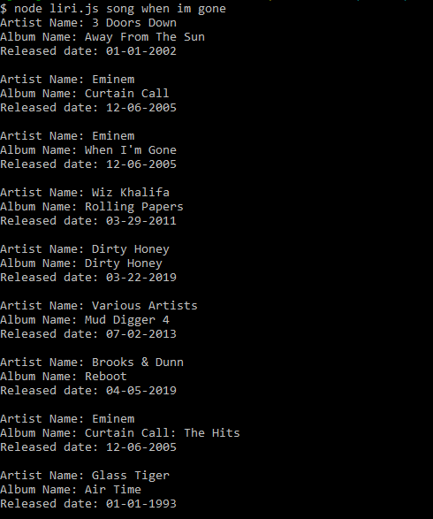
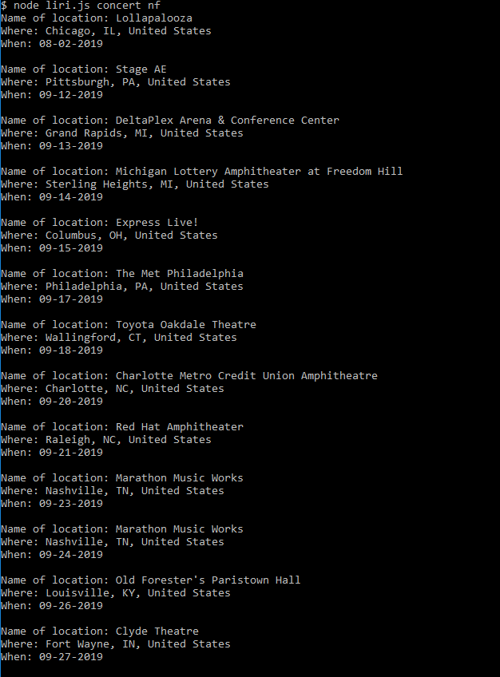
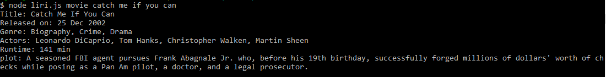

# Liri
## With liri you can recieve information from 3 difference sources

1. Spotify ( Gives you information about a song with the matching title )
2. Rest.Band ( Provieds if an artist as a upcomming concert )
3. OMDB ( Information about a certain movie )

# How to search for something

* For Spotify enter ( node liri.js song { title of the song } )
* For Rest.Band enter ( node liri.js concert { Name of the artist } )
* For OMDB enter ( node liri.js movie { title of the movie } )

# How the Spotify information looks
### when this runs it save some information in a separate file

# How the Rest.Band information looks

# How the Movie information looks

